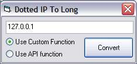



## CopyMemory example \- How is memory represented in VB?

### Description

This is more of a tutorial than a code submission. It shows you how the LONG variable is represented in memory by VB. It also shows you how data types are represented in memory and how to place custom bytes into longs without having to figure out what numeber all 4 bytes would be etc. It uses a simple function to domenstarte this which converts a dotted string IP address to it's long representation (they way it's represented in memory). And to prove it works, you can test it alongside the real API function used to do this. The tutorial is integrated into the commenting. Leave some feedback.
 
### More Info
 

             |
---                |---
**Submitted On**   |2003-03-05 19:09:56
**By**             |[IRBMe](https://github.com/Planet-Source-Code/PSCIndex/blob/master/ByAuthor/irbme.md)
**Level**          |Beginner
**User Rating**    |4.3 (26 globes from 6 users)
**Compatibility**  |VB 4\.0 \(32\-bit\), VB 5\.0, VB 6\.0
**Category**       |[Windows API Call/ Explanation](https://github.com/Planet-Source-Code/PSCIndex/blob/master/ByCategory/windows-api-call-explanation__1-39.md)
**World**          |[Visual Basic](https://github.com/Planet-Source-Code/PSCIndex/blob/master/ByWorld/visual-basic.md)
**Archive File**   |[CopyMemory155524362003\.zip](https://github.com/Planet-Source-Code/irbme-copymemory-example-how-is-memory-represented-in-vb__1-43774/archive/master.zip)

